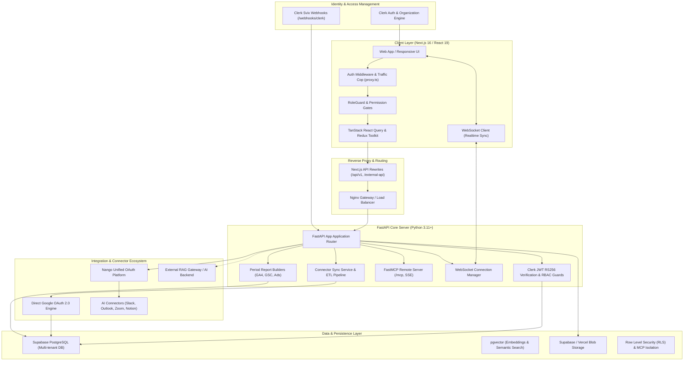
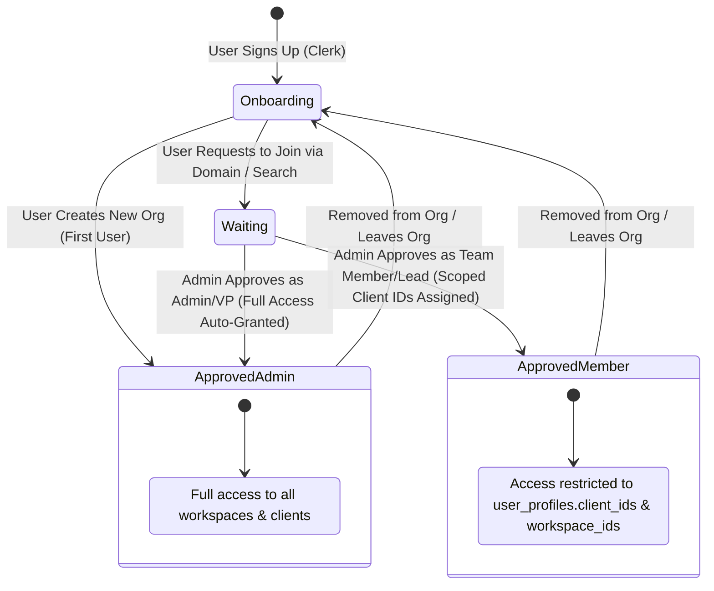
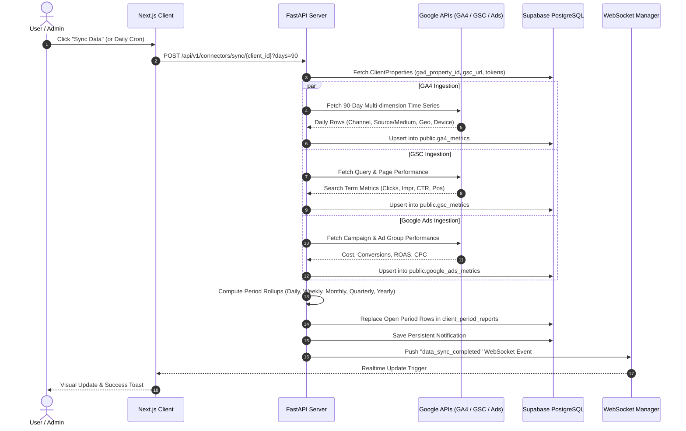
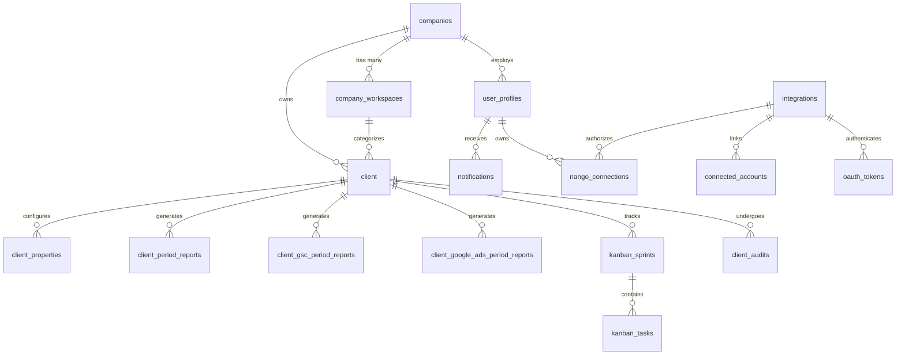

# TRU Reporting OS — System Architecture & Technical Reference Manual

---

## 1. Executive Summary & Architectural Overview

**TRU Reporting OS** is an enterprise-grade multi-tenant marketing intelligence, client workspace management, reporting automation, and AI execution platform. It unifies marketing data streams (Google Analytics 4, Google Search Console, Google Ads, Google Business Profile), team collaboration tools (Slack, Microsoft Outlook, Zoom, Notion, Intercom), presentation generation engines, agile Kanban task management, and autonomous AI agents through the **Model Context Protocol (MCP)**.



---

## 2. Complete Workspace Folder Structure

```
tru-os-dev-application/
├── .env.docker.example             # Template for Docker environment variables
├── docker-compose.yml              # Local multi-container Docker compose (client, server, nginx)
├── docker-compose.prod.yml         # Production multi-container Docker compose
├── DEPLOYMENT_GUIDE.md             # Production deployment instructions
├── README.md                       # High-level repository documentation
├── template_v2_rows.json           # Seed presentation template layout definitions
├── tru_reporting_os_sequence_v4.mermaid # System sequence diagram
├── tru_template_insert.sql         # SQL seed scripts for template generation
│
├── nginx/                          # Reverse Proxy Gateway
│   └── default.conf                # Nginx proxy pass rules (/api -> server:8000, / -> client:3005)
│
├── docs/                           # Project technical documentation
│   ├── connectors/                 # Connector-specific sync and auth documentation
│   ├── SYSTEM_ARCHITECTURE.md      # This comprehensive architecture document
│   ├── New Workspace.md            # Workspace onboarding flow docs
│   ├── chatbot_thinking_animation_update.md
│   ├── dashboard_filtering_and_ga4_sync_analysis.md
│   ├── fix_client_properties_mapping_overwrite.md
│   └── project_issues_and_architecture.md
│
├── server/                         # FastAPI Python Backend
│   ├── Dockerfile                  # Container definition for Python 3.11/FastAPI backend
│   ├── requirements.txt            # Python dependencies (FastAPI, Supabase, PyJWT, MCP, Google SDKs)
│   ├── run_connector_sync.py       # Standalone CLI runner for ETL data synchronizer
│   ├── schema_context.sql          # Snapshot of database schema definitions
│   ├── schema_ai_connectors.sql    # Schema for Nango connections & AI connector action logs
│   ├── nango_dump.txt              # Nango configuration and endpoint reference dump
│   │
│   └── app/                        # Application Root Package
│       ├── __init__.py
│       ├── main.py                 # FastAPI app entrypoint, CORS, exception handlers, MCP mount
│       ├── config.py               # Pydantic BaseSettings loading environment configurations
│       ├── database.py             # Supabase client singleton provider
│       ├── router.py               # Central APIRouter mounting all modular endpoint routers
│       │
│       ├── core/                   # Core settings & configurations
│       │   └── config.py
│       │
│       ├── db/                     # Database Clients
│       │   ├── supabase.py         # Standard Supabase client instance
│       │   └── supabase_admin.py   # Admin Supabase client (service_role bypass for ETL/cron)
│       │
│       ├── lib/                    # Authentication & Verification Libraries
│       │   └── auth/
│       │       └── clerk.py        # Clerk RS256 JWKS validation, Token decoding, User profile deps
│       │
│       ├── endpoints/              # API Route Controllers (/api/v1/*)
│       │   ├── health.py           # Health check probe (/api/v1/health)
│       │   ├── users.py            # User management, join requests, approval, profile editing
│       │   ├── clients.py          # Client workspace CRUD, company client filtering
│       │   ├── client_audits.py    # Client performance audits & deck URLs
│       │   ├── company_workspaces.py # Organization multi-workspace hierarchy management
│       │   ├── team_invitations.py # Domain discovery, Clerk invitations, pending invites
│       │   ├── companies.py        # Company entity retrieval
│       │   ├── kanban.py           # Kanban sprints, tasks, comments, attachments, reordering
│       │   ├── GA4_dashboards.py   # GA4 period report and client overview fetching
│       │   ├── gsc_dashboards.py   # Google Search Console period report retrieval
│       │   ├── connectors.py       # Synchronous ETL sync trigger for GA4/GSC/Ads
│       │   ├── integration.py      # Google OAuth 2.0 start, callback, token exchange, mapping
│       │   ├── integrations.py     # Workspace connected integrations listing
│       │   ├── nango.py            # Nango OAuth sessions, token persistence, account disconnect
│       │   ├── ai_connectors.py    # Inline slash command targets & proposed action re-hydration
│       │   ├── slack.py            # Slack channel listing, messaging, user-token resolution
│       │   ├── outlook.py          # Outlook folders, message querying, draft/email creation
│       │   ├── universal_chat.py   # Chat sessions, messages, history, and websocket streaming
│       │   ├── notifications.py    # User notification querying, mark-as-read, delete
│       │   ├── ai_briefing.py      # Client daily AI briefing retrieval
│       │   ├── workspaces.py       # Legacy workspaces endpoint
│       │   ├── webhooks.py         # Clerk Svix webhook receiver (user/org lifecycle sync)
│       │   ├── websockets.py       # Authenticated realtime WebSocket channel (/ws/{user_id})
│       │   └── mcp_tools.py        # Isolated tenant MCP tool proxy with token hash auth
│       │
│       ├── mcp/                    # Model Context Protocol Engine
│       │   ├── __init__.py
│       │   └── remote_server.py    # FastMCP server with tool catalog (GA4, GSC, Ads, GBP, DB)
│       │
│       ├── services/               # Business Logic & Service Layer
│       │   ├── user_service.py     # Clerk user/org sync, invite dispatcher, metadata updates
│       │   ├── client_properties_service.py # Resolves GA4 property IDs, GSC URLs, Ads customer IDs
│       │   ├── connector_sync_service.py    # Synchronizes 90-day time series data from APIs
│       │   ├── google_discovery_service.py  # Discovers GA4 properties, GSC sites, Ads accounts
│       │   ├── google_token_service.py      # Token refresh and credential management for Google
│       │   ├── google_ads_auth_service.py   # Google Ads customer client builder
│       │   ├── workspace_mapping_service.py # Auto-associates external accounts with clients
│       │   ├── marketing_summary_service.py # Computes high-level KPI rollups
│       │   ├── websocket_manager.py         # Thread-safe WebSocket connection registry & dispatch
│       │   ├── token_service.py             # Token encryption/decryption utilities
│       │   ├── dashboard_service.py         # Dashboard aggregation utilities
│       │   └── reports/            # Period Report Aggregation Builders
│       │       ├── ga4_report_builder.py        # Generates daily, weekly, monthly GA4 rollups
│       │       ├── gsc_report_builder.py        # Generates GSC clicks, impressions, CTR rollups
│       │       └── google_ads_report_builder.py # Generates Google Ads spend, ROAS, CPC rollups
│       │
│       ├── connectors/             # Direct Third-Party Data Fetchers
│       │   ├── google/             # Google API Adapters
│       │   │   ├── ga4.py          # Google Analytics Data API client
│       │   │   ├── ga4_catalog.py  # GA4 allowed dimension & metric whitelist
│       │   │   ├── ga4_validator.py# Dimension/metric validator
│       │   │   ├── gsc.py          # Search Console API client
│       │   │   ├── gsc_catalog.py  # GSC dimension whitelist
│       │   │   ├── gsc_validator.py# GSC query validator
│       │   │   ├── google_ads.py   # Google Ads search stream client
│       │   │   ├── google_ads_catalog.py
│       │   │   ├── google_ads_validator.py
│       │   │   └── google_business.py # GBP location & performance API client
│       │   ├── google_sync/        # Incremental Batch Synchronizers
│       │   │   ├── ga4.py          # Multi-dimension GA4 sync engine
│       │   │   ├── gsc.py          # Multi-dimension GSC sync engine
│       │   │   └── google_ads.py   # Multi-dimension Google Ads sync engine
│       │   └── meta/               # Meta Ads Integrations
│       │       ├── meta_ads.py
│       │       └── oauth.py
│       │
│       ├── ai_connectors/          # Nango-backed Live Tool Drivers
│       │   ├── nango_client.py     # HTTP client for Nango REST API
│       │   ├── utils.py            # Connector formatting helpers
│       │   └── connectors/
│       │       ├── slack.py        # Slack conversations list/history/postMessage
│       │       ├── outlook.py      # Outlook mail folders/messages/sendMail
│       │       ├── zoom.py         # Zoom recordings & meetings fetcher
│       │       ├── google_calendar.py # Calendar events reader/scheduler
│       │       ├── granola.py      # Granola AI meeting notes fetcher
│       │       ├── fathom.py       # Fathom meeting summaries fetcher
│       │       ├── intercom.py     # Intercom conversations fetcher
│       │       └── notion.py       # Notion pages/databases query client
│       │
│       ├── auto_mappings/          # Fuzzy Client-to-Property Matcher
│       │   ├── mapping_service.py  # Automatically matches unassigned accounts to clients
│       │   ├── matcher.py          # RapidFuzz string distance algorithms
│       │   └── text_normalizer.py  # Strips domains, protocols, punctuation for matching
│       │
│       ├── normalizers/            # Schema Normalizers for Database Insertion
│       │   ├── ga4_normalizer.py
│       │   ├── gsc_normalizer.py
│       │   ├── google_ads_normalizer.py
│       │   └── meta_ads_normalizer.py
│       │
│       ├── schemas/                # Pydantic Schemas
│       │   └── integration_schema.py
│       │
│       └── utils/                  # Server-wide Utilities
│           ├── encryption.py       # AES Fernet encryption for OAuth refresh tokens
│           ├── logger.py           # Standardized logger configuration
│           └── real_time.py        # NTP/Google server date fetcher (avoids clock drift)
│
└── client/                         # Next.js 16 App Router Frontend
    ├── Dockerfile                  # Multi-stage production container for Next.js
    ├── next.config.mjs             # Standalone output, image domains, API rewrite proxies
    ├── package.json                # React 19, Clerk, Radix, Redux, TipTap, Tailwind dependencies
    ├── proxy.ts                    # Clerk Next.js Middleware (Route protection & RBAC traffic cop)
    ├── tailwind.config.ts          # Tailwind CSS design tokens, animations, color system
    ├── tsconfig.json               # TypeScript strict configuration
    │
    ├── app/                        # Next.js App Router Structure
    │   ├── layout.tsx              # Root HTML layout, ThemeProvider, ToastProvider, Redux Store
    │   ├── page.tsx                # Marketing landing / authentication router
    │   ├── globals.css             # Tailwind core layers, animations, CSS custom properties
    │   │
    │   ├── (auth)/                 # Unauthenticated Onboarding Flow
    │   │   ├── sign-in/            # Clerk Sign-In Page
    │   │   └── sign-up/            # Clerk Sign-Up Page
    │   │
    │   ├── (dashboard)/            # Authenticated App Shells
    │   │   ├── onboarding/         # First-time org creation / domain join flow
    │   │   ├── admin/              # Admin/VP/Team Lead Management Console
    │   │   │   ├── layout.tsx      # Admin shell layout with Sidebar, Header, Breadcrumbs
    │   │   │   ├── page.tsx        # Executive overview dashboard
    │   │   │   ├── approve/        # Pending user approval queue & client access assignment
    │   │   │   ├── team/           # Team management, roles, invitations, domain discovery
    │   │   │   ├── workspaces/     # Company workspace switching and creation
    │   │   │   ├── integrations/   # Integration management (Google, Nango, Slack, etc.)
    │   │   │   ├── chatbotPage/    # Universal AI Assistant with tool invocation
    │   │   │   ├── mcp/            # MCP server credentials and execution logs
    │   │   │   ├── accountSettings/# Admin profile & password settings
    │   │   │   ├── pricing/        # Subscription & seat tier settings
    │   │   │   └── clients/        # Client list & Client Sub-hub
    │   │   │       └── [slug]/     # Dynamic Client Workspace
    │   │   │           ├── page.tsx      # Client command center overview
    │   │   │           ├── dashboard/    # Live GA4/GSC/Ads multi-period dashboard
    │   │   │           ├── kanban/       # Client sprint board & task management
    │   │   │           ├── decks/        # Automated presentation & QBR decks
    │   │   │           ├── audit/        # Client performance audit reports
    │   │   │           └── settings/     # Client properties & connector mappings
    │   │   │
    │   │   └── user/               # Standard Team Member / Client Viewer Portal
    │   │       ├── layout.tsx      # User shell layout
    │   │       ├── page.tsx        # Assigned clients overview
    │   │       ├── waiting-room/   # Waiting room UI for unapproved users
    │   │       ├── accountSettings/# User profile editor
    │   │       └── clients/        # User-accessible client sub-routes
    │   │
    │   ├── (web)/                  # Public Marketing & Demo Pages
    │   │   ├── about/
    │   │   ├── pricing/
    │   │   ├── product/
    │   │   └── solutions/
    │   │
    │   └── api/                    # Internal Next.js Route Handlers
    │       ├── ai-briefing/        # Proxy for morning AI briefings
    │       ├── export-presentation/# Headless presentation export engine (PPTX / PDF)
    │       ├── export-presentation-data/ # Data payload endpoint for slide builder
    │       ├── image/              # Image caching and optimization proxy
    │       ├── ppt-proxy/          # Proxy for slide streaming
    │       ├── save-layout/        # Persists custom slide JSX/HTML layouts
    │       ├── template/           # Slide template fetching
    │       ├── templates/          # Template collection querying
    │       ├── update-svg/         # SVG theme color updates
    │       ├── upload/             # Attachment upload handler
    │       ├── upload-image/       # Vercel Blob / Supabase Image uploader
    │       ├── user-config/        # User configuration store endpoint
    │       └── validate-layout-code/ # Babel AST validator for slide layouts
    │
    ├── components/                 # Reusable UI & Business Components
    │   ├── RoleGuard.tsx           # Declarative React RBAC gate component
    │   ├── shell/                  # Navigation bar, Sidebar, User Menu, Header, Notifications
    │   ├── ui/                     # Radix UI primitives (Button, Dialog, Dropdown, Table, Input)
    │   ├── dashboard/              # GA4/GSC charts, metric cards, period selectors, sync triggers
    │   ├── kanban/                 # Drag-and-drop Sprint board, Task modals, Comments, Filters
    │   ├── chat/                   # Universal Chat UI, Slash commands, Tool confirmation cards
    │   ├── team/                   # Team table, Invite modals, Domain colleague discovery card
    │   ├── deck/                   # Presentation generator, Slide viewer, Layout selector
    │   ├── pptui/                  # PPTX slide editor & visual components
    │   ├── audit/                  # Client audit generator & stage progress indicators
    │   └── icons/                  # SVG brand icons (Google, Slack, Outlook, Nango, Zoom)
    │
    ├── lib/                        # Core Frontend Utilities & Business Logic
    │   ├── supabaseClient.ts       # Frontend Supabase browser client
    │   ├── fastapi-internal.ts     # Internal fetch wrapper with Clerk session token injection
    │   ├── template-v2-json-to-html.ts # AST parser: Template JSON -> Rendered HTML
    │   ├── run-bundled-presentation-export.ts # PPTX export engine (PptxGenJS / html2canvas)
    │   ├── validate-layout-code.ts # Babel parser for runtime validation of custom slide code
    │   ├── user-config-store.ts    # User settings state persistence
    │   ├── server-template-layouts.ts # Presentation layout definitions
    │   │
    │   ├── Api/                    # Modular API Service Methods (58 specialized endpoints)
    │   │   ├── FetchCurrentUser.ts
    │   │   ├── FetchClient.ts
    │   │   ├── CreateClient.ts
    │   │   ├── UpdateClient.ts
    │   │   ├── DeleteClient.ts
    │   │   ├── FetchCompanyWorkspaces.ts
    │   │   ├── FetchTeamInvitations.ts
    │   │   ├── FetchWaitingUsers.ts
    │   │   ├── FetchApproveUser.ts
    │   │   ├── FetchAdminUpdateUser.ts
    │   │   ├── FetchAdminRemoveUser.ts
    │   │   ├── FetchClientGA4Dashboard.ts
    │   │   ├── FetchClientGSCDashboard.ts
    │   │   ├── FetchKanban.ts
    │   │   ├── CreateSprint.ts
    │   │   ├── CreateTask.ts
    │   │   ├── UpdateTaskStatus.ts
    │   │   ├── CreateNangoConnectSession.ts
    │   │   ├── FinalizeNangoConnection.ts
    │   │   ├── DisconnectNango.ts
    │   │   ├── FetchNotifications.ts
    │   │   ├── ConfirmConnectorAction.ts
    │   │   └── ... (58 typed client API calls)
    │   │
    │   ├── Types/                  # TypeScript Data Models & Contract Interfaces
    │   │   ├── roles.ts            # ROLES constants ('admin', 'vp', 'team_lead', 'team_member', 'client', 'user')
    │   │   ├── index.ts            # Core entity models (Client, Dashboard, Report, Company)
    │   │   ├── kanban.ts           # Sprint, Task, Comment, Attachment type definitions
    │   │   ├── aiConnectors.ts     # Nango connection, target, and proposed action contracts
    │   │   ├── companyWorkspace.ts # Organization workspace types
    │   │   ├── presentation.ts     # Slide, Layout, Theme, Outline models
    │   │   └── llm_config.ts       # Model parameters & prompt structures
    │   │
    │   ├── context/                # React Context Providers
    │   │   └── CompanyWorkspaceContext.tsx # Active workspace selector & state provider
    │   │
    │   ├── store/                  # Redux Toolkit State Management
    │   │   ├── store.ts            # Root Redux store configuration
    │   │   ├── StoreProvider.tsx   # React-Redux Provider wrapper
    │   │   └── slices/
    │   │       ├── presentationGeneration.ts # Slide builder & generation state
    │   │       ├── presentationGenUpload.ts   # Upload state management
    │   │       ├── undoRedoSlice.ts           # Undo/redo history stack for slide editor
    │   │       └── userConfig.ts              # Local app configuration slice
    │   │
    │   ├── state/                  # Zustand / Custom State Hooks
    │   │   ├── useDeck.ts          # Presentation slide selection & outline state
    │   │   ├── persona.ts          # Active AI persona state
    │   │   └── toast.ts            # Toast notification trigger state
    │   │
    │   └── utils/                  # Frontend Helper Utilities
    │       ├── api.ts              # Dynamic base URL resolution & unified API client
    │       ├── apiErrorMessages.ts # HTTP error code & message parser
    │       ├── auth.ts             # Clerk auth token retrieval
    │       ├── authErrors.ts       # Authentication error categorizer
    │       ├── mixpanel.ts         # Mixpanel user event telemetry
    │       ├── format.ts           # Number, date, currency, and percentage formatters
    │       ├── image-url-converter.ts # Supabase storage & relative URL resolver
    │       ├── providerConstants.ts# Third-party integration metadata & logos
    │       ├── providerUtils.ts    # OAuth scope & connection status evaluators
    │       ├── providers.tsx       # Root context wrapper (QueryClient, Theme, Store)
    │       ├── serverAuth.ts       # Server component authentication guards
    │       ├── storeHelpers.ts     # Immutable state update helpers
    │       └── presentationLimits.ts # Slide count & token constraint definitions
    │
    └── hooks/                      # Custom React Hooks
        ├── useWebsocket.ts         # Live WebSocket listener for notifications & approval events
        └── ...
```

---

## 3. Technology Stack & Key Packages

### 3.1 Frontend Architecture

| Category | Technology / Package | Version | Purpose |
| :--- | :--- | :--- | :--- |
| **Core Framework** | Next.js (App Router) | `^16.2.6` / `15+` | Server components, static optimization, dynamic routing, API route handlers |
| **UI Library** | React / React DOM | `^19.2.6` | Component model, Concurrent features, Server actions |
| **Authentication** | `@clerk/nextjs` | `^7.3.3` | User identity, JWT issuance, Organization multi-tenancy, Middleware |
| **State Management** | `@reduxjs/toolkit` & `react-redux` | `^2.2.8` / `^9.1.2` | Global slide builder state, undo/redo stacks, presentation cache |
| **Server State** | `@tanstack/react-query` | `^5.100.6` | Query caching, automatic refetching, mutation lifecycle, optimistic UI |
| **UI Primitives** | `@radix-ui/react-*` | Latest | Accessible, unstyled primitives (Dialog, Dropdown, Tabs, Popover, Select) |
| **Drag & Drop** | `@dnd-kit/core`, `@dnd-kit/sortable`| `^6.3.1` / `^10.0.0` | Kanban board task movement, sprint reordering, slide sorting |
| **Rich Text Editor** | `@tiptap/react`, `@tiptap/starter-kit`| `^2.11.5` | Rich text task descriptions, notes, presentation slide content editing |
| **Data Visualization** | `recharts`, `chart.js`, `react-chartjs-2` | `^2.12.7` / `^4.5.1` | Interactive GA4 traffic trends, GSC CTR charts, Ads performance graphs |
| **Canvas & Graphics** | `konva`, `react-konva` | `^10.3.0` / `^19.2.4` | Interactive slide design canvas, custom shapes, visual overlays |
| **Export Engines** | `pptxgenjs`, `puppeteer`, `html2canvas` | `^4.0.1` / `^25.3.0` | Client-side PowerPoint generation and headless PDF rendering |
| **Code Validation** | `@babel/standalone`, `@babel/traverse` | `^7.29.8` | In-browser JSX/HTML layout parser & code security validator |
| **Icons & Animation** | `lucide-react`, `motion`, `tailwindcss-animate` | `^0.451.0` / `^12.38.0` | Vector icon system and fluid UI animations |
| **Analytics & Telemetry** | `mixpanel-browser` | `^2.67.0` | Product analytics, user event tracking, conversion funnel metrics |
| **Styling** | `tailwindcss`, `tailwind-merge`, `clsx` | `^3.4.13` / `^3.6.0` | Utility-first CSS with dynamic class merging and token system |

### 3.2 Backend Architecture

| Category | Technology / Package | Version | Purpose |
| :--- | :--- | :--- | :--- |
| **API Framework** | `fastapi` & `starlette` | `0.136.3` / `1.1.0` | High-performance async REST API, OpenAPI auto-documentation, WebSockets |
| **ASGI Server** | `uvicorn` | `0.48.0` | Async server worker handling HTTP/1.1, HTTP/2, WebSockets |
| **Schema Validation** | `pydantic` & `pydantic-settings` | `2.13.4` / `2.14.1` | Strong typing, request/response models, environment variable validation |
| **Database SDK** | `supabase`, `postgrest`, `storage3` | `2.30.0` | Supabase Postgres client, Realtime listeners, Storage bucket API |
| **Auth & Security** | `PyJWT`, `cryptography` (Fernet) | `2.13.0` / `48.0.0` | Clerk RS256 JWKS validation, AES encryption for stored OAuth tokens |
| **Webhook Verification**| `svix`, `standardwebhooks` | `1.94.0` / `1.0.1` | Cryptographic verification of Clerk Svix webhook signatures |
| **Model Context Protocol**| `mcp`, `fastapi-mcp` | Latest | Standardized agent-to-tool protocol exposing GA4, GSC, Ads & DB to LLMs |
| **Google Cloud SDKs** | `google-analytics-data`, `google-ads`, `google-api-python-client` | Latest | Official SDKs for GA4 reporting, Search Console querying, Google Ads API |
| **Fuzzy Matching** | `rapidfuzz` | Latest | Levenshtein string distance algorithm for automatic client-property mapping |
| **HTTP Client** | `httpx`, `requests` | `0.28.1` / `2.34.2` | Async non-blocking HTTP requests for external APIs, Nango, and webhooks |
| **Time & Date** | `python-dateutil` | `2.9.0` | Reliable period parsing and ISO-8601 calculations |

---

## 4. Role-Based Access Control (RBAC) & Security Architecture

### 4.1 Multi-Tenant Organization Hierarchy

The application implements a strict 3-tier multi-tenant hierarchy:

```
[Company / Organization] (e.g., TruPerformance)
   └── [Company Workspaces] (e.g., US Marketing, EU Enterprise)
         └── [Clients] (e.g., Acme Corp, TechStart)
               ├── GA4 / GSC / Google Ads Connections
               ├── Kanban Sprints & Tasks
               ├── Generated Decks & Audits
               └── Slack / Outlook Channels
```

1. **Company**: Represents the parent enterprise organization. Mapped 1:1 with a Clerk Organization (`clerk_org_id`) and an email domain (`domain`, e.g., `@truperformance.us`).
2. **Company Workspace**: Sub-divisions within a company allowing segregation by departments, regional offices, or business units (`company_workspaces` table).
3. **Client**: The specific brand or client account under management (`client` table). All analytics, sprints, tasks, and reports belong to a Client.

---

### 4.2 Role Definitions & Permission Matrix

The application defines 6 distinct roles (`client/lib/Types/roles.ts` & `public.roles`):

```typescript
export const ROLES = {
  ADMIN: "admin",
  VP: "vp",
  TEAM_LEAD: "team_lead",
  TEAM_MEMBER: "team_member",
  CLIENT: "client",
  USER: "user"
} as const;
```

| Permission / Action | Admin | VP | Team Lead | Team Member | Client | User (Unassigned) |
| :--- | :---: | :---: | :---: | :---: | :---: | :---: |
| **Approve Waiting Users** | Yes | Yes | No | No | No | No |
| **Modify User Roles / Access** | Yes | Yes | No | No | No | No |
| **Remove / Offboard Users** | Yes | Yes | No | No | No | No |
| **Send Organization Invites** | Yes | Yes | Yes | No | No | No |
| **Create / Delete Workspaces**| Yes | Yes | Yes | No | No | No |
| **Create / Delete Clients** | Yes | Yes | No | No | No | No |
| **View All Company Clients** | Yes | Yes | Assigned Only | Assigned Only | Assigned Only | None |
| **Trigger ETL Data Sync** | Yes | Yes | Assigned Only | Assigned Only | No | No |
| **Manage Kanban Sprints/Tasks**| Yes | Yes | Yes | Assigned Only | Read-only | No |
| **Access Admin Console (/admin)**| Yes | Yes | Yes | Yes | No | No |
| **Access Client Portal (/user)** | Yes | Yes | Yes | Yes | Yes | Waiting Room Only |

---

### 4.3 User Lifecycle State Machine



1. **`status: "onboarding"`**: User has signed up in Clerk but does not belong to any organization. Redirected strictly to `/onboarding`.
2. **`status: "waiting"`**: User requested to join an existing organization (matching email domain or search). User is locked in `/user/waiting-room` until approved. Real-time WebSocket listener (`user_approved`) instantly unlocks their session upon admin approval without requiring a manual refresh.
3. **`status: "approved"`**: User has been approved and provisioned with specific `role`, `client_ids`, and `workspace_ids`.

---

### 4.4 Route Protection & Middleware Enforcement

#### 1. Next.js Traffic Cop Middleware (`client/proxy.ts`)
Intercepts every HTTP request in the Next.js runtime:
- **Public Whitelist**: Bypasses authentication for marketing pages (`/`, `/about`, `/pricing`), Clerk webhooks (`/api/clerk/*`), and headless export endpoints (`/api/export-presentation*`).
- **Onboarding Gate**: If `status === "onboarding"`, forces redirect to `/onboarding`.
- **Waiting Room Gate**: If `status === "waiting"`, queries Clerk backend for fresh claims (avoiding stale JWT race conditions) and confines the user to `/user/waiting-room`.
- **RBAC Admin Route Gate**: Protects `/admin/*` routes — ensures only `admin`, `vp`, `team_lead`, and `team_member` roles can enter; other roles are redirected to `/user`.

#### 2. Declarative React Gate (`client/components/RoleGuard.tsx`)
Wraps granular UI elements and pages:
```tsx
<RoleGuard allowed={["admin", "vp"]} fallback={<p>Access Denied</p>}>
  <AdminApprovalQueue />
</RoleGuard>
```

#### 3. FastAPI Server-Side Auth Dependencies (`server/app/lib/auth/clerk.py`)
- **`verify_clerk_token`**: Validates the Bearer token in the `Authorization` header against Clerk's cached RS256 JWKS keys with SSRF-protected issuer validation.
- **`get_current_user_profile`**: Extracts the user's DB profile from `public.user_profiles`, verifying that `status == 'approved'` and `company_id` is set.
- **`get_current_user_company`**: Resolves `company_id` directly for tenant-scoped operations.
- **`get_current_user_profile_unrestricted`**: Bypasses the `status == 'approved'` check for `/users/me` and `/users/request-join` so waiting users can read their status.
- **`verify_clerk_token_ws`**: Authenticates WebSocket handshake query parameters.

---

## 5. Core API Architecture & Communication Flows

### 5.1 FastAPI Backend Endpoints Reference (`/api/v1`)

```mermaid
graph LR
    subgraph FastAPI_Router ["/api/v1 Central Router"]
        U["/users"]
        TI["/team/invitations"]
        C["/clients"]
        CW["/company-workspaces"]
        KB["/kanban"]
        GA["/ga4-dashboards"]
        GSC["/gsc-dashboards"]
        CON["/connectors"]
        INT["/integrations & /auth"]
        NANGO_R["/nango"]
        AIC["/ai-connectors"]
        SLACK_R["/slack"]
        OUT_R["/outlook"]
        NOTIF["/notifications"]
        MCP_R["/mcp-tools"]
        WS_R["/ws"]
        WH["/webhooks"]
    end
```



#### 1. Identity, Users & Team Management
| Method | Endpoint | Auth | Description |
| :--- | :--- | :---: | :--- |
| `GET` | `/api/v1/users/me` | Unrestricted | Fetches authenticated caller profile (including waiting status) |
| `PATCH` | `/api/v1/users/me` | Unrestricted | Updates caller profile (name, designation, phone, bio, image) |
| `POST` | `/api/v1/users/request-join`| Unrestricted | Requests to join an organization by domain or company ID |
| `GET` | `/api/v1/users/` | Approved | Lists all approved users in the caller's company |
| `GET` | `/api/v1/users/waiting` | Approved (Admin/VP)| Lists pending users awaiting approval |
| `POST` | `/api/v1/users/{clerk_id}/approve` | Admin / VP | Approves user, assigns role, workspace IDs, and client IDs |
| `PATCH` | `/api/v1/users/{clerk_id}/admin_update`| Admin / VP | Modifies an existing user's role and assigned client IDs |
| `DELETE`| `/api/v1/users/{clerk_id}/remove`| Admin / VP | Offboards user, removes from Clerk Org, resets to onboarding |
| `POST` | `/api/v1/users/me/leave` | Approved | Leaves current company organization |
| `GET` | `/api/v1/team/invitations/discover`| Approved | Discovers colleagues sharing domain not yet in workspace |
| `POST` | `/api/v1/team/invitations/send` | Admin / VP / Lead| Sends Clerk organization email invitation |
| `POST` | `/api/v1/team/invitations/{id}/revoke`| Admin / VP | Revokes pending Clerk organization invitation |

#### 2. Workspaces & Client Accounts
| Method | Endpoint | Auth | Description |
| :--- | :--- | :---: | :--- |
| `GET` | `/api/v1/company-workspaces/` | Approved | Lists workspaces (filtered by role and assigned workspace_ids) |
| `POST` | `/api/v1/company-workspaces/` | Admin/VP/Lead | Creates a new company workspace subdivision |
| `PUT` | `/api/v1/company-workspaces/{id}` | Admin/VP/Lead | Renames a company workspace |
| `DELETE`| `/api/v1/company-workspaces/{id}` | Admin/VP/Lead | Deletes a workspace (guards against deleting final workspace) |
| `GET` | `/api/v1/clients/` | Approved | Fetches clients (Admins see all; members see assigned `client_ids` only) |
| `GET` | `/api/v1/clients/{client_id}` | Approved | Gets client details with permission guard |
| `POST` | `/api/v1/clients/` | Approved | Creates a client and auto-generates linked workspace |
| `PUT` | `/api/v1/clients/{client_id}` | Approved | Updates client metadata, branding, and contact info |
| `DELETE`| `/api/v1/clients/{client_id}` | Approved | Deletes client and associated data |

#### 3. Marketing Analytics & ETL Synchronization
| Method | Endpoint | Auth | Description |
| :--- | :--- | :---: | :--- |
| `GET` | `/api/v1/ga4-dashboards/{key}` | Approved | Retrieves GA4 period report (`daily`, `weekly`, `monthly`, `quarterly`, `yearly`) |
| `GET` | `/api/v1/gsc-dashboards/{key}` | Approved | Retrieves GSC search performance report for specified period |
| `POST` | `/api/v1/connectors/sync/{client_id}`| Approved | Synchronously executes 90-day sync for GA4, GSC, and Ads, stores period rollups, and pushes WebSocket notification |
| `GET` | `/api/v1/ai-briefing/briefing` | Approved | Fetches automated morning briefing summary for a client |

#### 4. Integrations & OAuth Management
| Method | Endpoint | Auth | Description |
| :--- | :--- | :---: | :--- |
| `GET` | `/auth/google/start` | Public | Generates Google OAuth URL with requested scopes (GA4, GSC, Ads, GBP) |
| `GET` | `/auth/google/callback` | Public | Exchanges Google auth code for tokens, encrypts refresh token, stores in DB |
| `GET` | `/auth/google/discovery` | Approved | Discovers available GA4 properties, GSC URLs, and Ads accounts |
| `POST` | `/auth/workspace/map` | Approved | Maps discovered properties to a client |
| `POST` | `/api/v1/nango/connect-session` | Approved | Creates Nango Connect session token for Slack, Outlook, Zoom, etc. |
| `POST` | `/api/v1/nango/finalize-connection`| Approved | Persists connection ID linked to user and workspace |
| `POST` | `/api/v1/nango/disconnect` | Approved | Deletes Nango connection and clears integration state |

#### 5. Agile Kanban Management
| Method | Endpoint | Auth | Description |
| :--- | :--- | :---: | :--- |
| `GET` | `/api/v1/kanban/{client_slug}` | Approved | Lists all sprints with summary statistics (total, completed, working, blocked) |
| `POST` | `/api/v1/kanban/{client_slug}/sprints` | Approved | Creates a new sprint |
| `PUT` | `/api/v1/kanban/sprints/{sprint_id}` | Approved | Updates sprint title, date range, or status |
| `DELETE`| `/api/v1/kanban/sprints/{sprint_id}` | Approved | Deletes sprint |
| `GET` | `/api/v1/kanban/sprints/{sprint_id}/tasks`| Approved | Fetches tasks within a sprint grouped by status column |
| `POST` | `/api/v1/kanban/{client_slug}/tasks` | Approved | Creates a task with assignees, priority, channel, and due date |
| `PUT` | `/api/v1/kanban/tasks/{task_id}` | Approved | Updates task details |
| `PATCH` | `/api/v1/kanban/tasks/{task_id}/status`| Approved | Moves task across columns (TODO, WORKING, BLOCKED, COMPLETED) |
| `POST` | `/api/v1/kanban/tasks/{task_id}/comments`| Approved | Adds comment to task |
| `POST` | `/api/v1/kanban/tasks/{task_id}/attachments`| Approved| Uploads file attachment to task |

#### 6. AI Connectors, Universal Chat & MCP Tools
| Method | Endpoint | Auth | Description |
| :--- | :--- | :---: | :--- |
| `GET` | `/api/v1/ai-connectors/targets/{provider}`| Approved | Lists live message targets (Slack channels, Outlook folders, Zoom recordings) |
| `GET` | `/api/v1/ai-connectors/pending-actions`| Approved | Fetches proposed connector actions for card rehydration |
| `GET` | `/api/v1/universal-chat/sessions` | Approved | Lists user chat sessions |
| `POST` | `/api/v1/universal-chat/sessions` | Approved | Creates a new chat thread |
| `POST` | `/api/v1/universal-chat/messages` | Approved | Submits message to AI assistant and stores history |
| `GET` | `/api/v1/mcp-tools/integrations` | MCP Bearer | Resolves tenant workspace from token hash and returns integrations |
| `GET` | `/api/v1/mcp-tools/accounts` | MCP Bearer | Tenant-isolated account querying |

#### 7. Webhooks & Real-time WebSockets
| Method | Endpoint | Auth | Description |
| :--- | :--- | :---: | :--- |
| `POST` | `/webhooks/clerk` | Svix Signature | Handles Clerk events (`user.created`, `organization.created`, `membership.created`, `membership.deleted`) |
| `WS` | `/api/v1/ws/{user_id}` | Token Query Param| Secure real-time notification & approval event stream |

---

### 5.2 Frontend Next.js API Routes (`client/app/api/*`)

These serverless route handlers run on the Next.js server runtime:
1. **`/api/export-presentation`**: Uses Puppeteer headless browser to render presentation slides and generate downloadable high-resolution PDFs or PPTX files.
2. **`/api/export-presentation-data`**: Serves slide AST schemas and styling variables to the headless exporter.
3. **`/api/save-layout` & `/api/templates`**: Reads and writes custom presentation layout templates to local storage or database.
4. **`/api/validate-layout-code`**: Runs Babel standalone AST analysis on user-submitted React/JSX slide components to prevent XSS and syntax errors before saving.
5. **`/api/upload` & `/api/upload-image`**: Handles multi-part file uploads, generating public URLs via Vercel Blob or Supabase Storage.
6. **`/api/image`**: Secure image proxy preventing mixed-content and CORS errors when rendering remote screenshots or client logomarks.

---

### 5.3 Model Context Protocol (MCP) Server Architecture

The backend includes a **FastMCP** server (`server/app/mcp/remote_server.py`) mounted at `/mcp` with SSE streaming:

```
[External AI Agent / LLM]
       │
       ▼ (MCP Protocol via /mcp/sse or /api/v1/mcp-tools)
[TRU Connect FastMCP Server]
       ├── Tenant Resolver (Bearer Token Hash -> Workspace ID)
       ├── Tool Whitelist & Schema Validator
       └── Execution Sandbox
             ├── run_ga4_report (Sessions, Users, Conversions, Bounce Rate)
             ├── run_gsc_report (Queries, Clicks, Impressions, Position)
             ├── run_google_ads_report (Spend, Conversions, ROAS, CPC)
             ├── get_google_business_performance (Calls, Directions, Views)
             └── query_client_database (Clients, Sprints, Integrations)
```

**Security & Tenant Isolation Rule**:
The AI model can never provide a `workspace_id` parameter directly (preventing prompt injection tenant hopping). The workspace identity is resolved server-side from the SHA-256 hash of the opaque MCP Bearer token stored in `mcp_credentials`.

---

## 6. Data Connectors, ETL Pipeline & Reporting Engine

### 6.1 Connector Data Ingestion Flow



---

### 6.2 Period Rollup Calculation Logic

To prevent duplicate stale rows as days progress, the system uses open-period boundary calculations (`server/app/services/connector_sync_service.py`):
1. **`yesterday`**: Closed single-day snapshot (`daily`).
2. **`week_start`**: Beginning of current ISO week (`weekly`).
3. **`month_start`**: 1st of current calendar month (`monthly`).
4. **`quarter_start`**: 1st of current quarter (`quarterly`).
5. **`half_start`**: 1st of current half-year (`half_yearly`).
6. **`year_start`**: Jan 1 of current year (`yearly`).

Before generating a new rollup, `_clear_open_period_row` purges any existing record for that `period_type` and `period_start`, guaranteeing that the live period updates cleanly in-place every day until closed.

---

## 7. Comprehensive Utilities & Helper Modules Reference

### 7.1 Server Utilities

| Module | Location | Functions / Classes | Purpose |
| :--- | :--- | :--- | :--- |
| **`encryption.py`** | `server/app/utils/` | `encrypt_value(v)`, `decrypt_value(v)` | AES Fernet encryption/decryption of OAuth tokens |
| **`real_time.py`** | `server/app/utils/` | `get_real_today()` | Fetches real date from Google HTTP Date header to prevent server clock drift |
| **`logger.py`** | `server/app/utils/` | `logger` | Centralized logging formatting |
| **`clerk.py`** | `server/app/lib/auth/` | `verify_clerk_token()`, `get_current_user_profile()`, `get_current_user_company()`, `verify_clerk_token_ws()`, `is_valid_clerk_issuer()` | JWT verification, RS256 decoding, SSRF issuer validation, user profile dependency injection |
| **`user_service.py`** | `server/app/services/` | `update_clerk_metadata()`, `add_user_to_clerk_org()`, `remove_user_from_clerk_org()`, `get_email_domain()`, `send_clerk_org_invitation()`, `list_clerk_org_invitations()`, `revoke_clerk_org_invitation()`, `get_clerk_users_by_domain()` | Clerk REST API wrapper for organizations, memberships, invitations, and metadata |
| **`websocket_manager.py`**| `server/app/services/` | `ConnectionManager`, `manager.connect()`, `manager.disconnect()`, `manager.send_personal_message()`, `manager.broadcast()` | Async thread-safe WebSocket connection registry |
| **`mapping_service.py`** | `server/app/auto_mappings/`| `MappingService.auto_map()` | Automates matching of discovered analytics properties to client records |
| **`matcher.py`** | `server/app/auto_mappings/`| `find_best_match()` | RapidFuzz fuzzy token sort matching |
| **`text_normalizer.py`** | `server/app/auto_mappings/`| `normalize_text()` | Strips HTTP protocols, TLDs, and special characters for clean matching |
| **`normalizers/*`** | `server/app/normalizers/` | `ga4_normalizer`, `gsc_normalizer`, `google_ads_normalizer` | Maps raw API payloads into typed database records |

---

### 7.2 Client Utilities

| Module | Location | Functions / Exports | Purpose |
| :--- | :--- | :--- | :--- |
| **`api.ts`** | `client/lib/utils/` | `getFastAPIUrl()`, `getApiUrl()`, `getApiErrorMessage()`, `fetchWithAuth()` | Dynamic API host resolution (Electron, Docker, Web) and unified HTTP fetcher |
| **`apiErrorMessages.ts`**| `client/lib/utils/` | `extractApiErrorMessage()` | Parses JSON/text error responses from FastAPI and displays human-readable error strings |
| **`auth.ts`** | `client/lib/utils/` | `isAuthDisabled()`, `getAuthToken()` | Client auth helper utilities |
| **`serverAuth.ts`** | `client/lib/utils/` | `getServerAuthStatus()`, `requireAppSession()` | Authentication guards for Next.js Server Components |
| **`format.ts`** | `client/lib/utils/` | `formatNumber()`, `formatCurrency()`, `formatPercent()`, `formatDate()` | Clean formatting for dashboard metric cards and tables |
| **`image-url-converter.ts`**| `client/lib/utils/`| `convertImageUrl()` | Resolves relative paths, Blob URLs, and Supabase public storage links |
| **`mixpanel.ts`** | `client/lib/utils/` | `trackEvent()`, `identifyUser()`, `resetUser()` | Mixpanel product analytics telemetry |
| **`providerConstants.ts`**| `client/lib/utils/` | `PROVIDER_METADATA`, `PROVIDER_SCOPES` | Logos, colors, brand names, and scope requirements for all integrations |
| **`providerUtils.ts`** | `client/lib/utils/` | `getProviderStatus()`, `isProviderConnected()` | Checks connection health and token expiration |
| **`providers.tsx`** | `client/lib/utils/` | `Providers` | Root React Context wrapper: Redux `StoreProvider`, TanStack `QueryClientProvider`, `ThemeProvider` |
| **`storeHelpers.ts`** | `client/lib/utils/` | `createAsyncSlice()`, `updateEntity()` | Redux Toolkit slice helper utilities |
| **`presentationLimits.ts`**| `client/lib/utils/`| `PRESENTATION_LIMITS` | Slide count, prompt length, and token caps |
| **`template-v2-json-to-html.ts`**| `client/lib/` | `templateV2JsonToHtml()` | Transforms JSON slide AST specifications into responsive HTML/CSS |
| **`run-bundled-presentation-export.ts`**| `client/lib/` | `exportToPptx()`, `exportToPdf()` | Exports presentation to PPTX or PDF |
| **`validate-layout-code.ts`**| `client/lib/` | `validateLayoutCode()` | Babel-based runtime JSX/React code validator |
| **`CompanyWorkspaceContext.tsx`**| `client/lib/context/`| `CompanyWorkspaceProvider`, `useCompanyWorkspace()` | React Context for managing current active workspace and client selector |

---

## 8. Database Schema & Entity Relationships



### Key Database Tables

1. **`companies`**: Organization entity (`id`, `name`, `clerk_org_id`, `domain`, `created_at`).
2. **`company_workspaces`**: Sub-workspaces within an org (`id`, `company_id`, `name`, `created_at`).
3. **`user_profiles`**: User records (`id`, `clerk_id`, `company_id`, `email`, `role`, `status`, `client_ids`, `workspace_ids`, `designation`).
4. **`client`**: Client workspace entities (`id`, `key`, `name`, `company_id`, `workspace_id`, `healthScore`, `retainer`, `accent`).
5. **`client_properties`**: Mapping connector properties to clients (`client_id`, `ga4_property_id`, `gsc_property_url`, `google_ads_customer_id`, `integration_id`).
6. **`ga4_metrics` / `gsc_metrics` / `google_ads_metrics`**: Raw daily granular time-series data synced from Google APIs.
7. **`client_period_reports` / `client_gsc_period_reports` / `client_google_ads_period_reports`**: Aggregated rollups for standard periods (`daily`, `weekly`, `monthly`, `quarterly`, `yearly`).
8. **`kanban_sprints` & `kanban_tasks`**: Agile sprint project management system.
9. **`nango_connections`**: Active Nango unified OAuth connection links.
10. **`notifications`**: Persistent notification records pushed to users in real time.
11. **`mcp_credentials` & `mcp_tool_logs`**: Tenant-isolated credentials and audit trails for LLM agent MCP tools.
12. **`presentations`, `slides`, `template_v2`**: Presentation generation data models and AST layouts.

---

## 9. Environment Configuration & Deployment Architecture

### 9.1 Environment Variables Reference

#### Server (`server/.env`)
```bash
# Application
APP_NAME=tru-os-dev-backend
DEBUG=False
API_V1_STR=/api/v1
BACKEND_URL=http://localhost:8000
FRONTEND_URL=https://tru-reporting-dev-application.vercel.app

# Supabase
SUPABASE_URL=https://<your-project>.supabase.co
SUPABASE_ANON_KEY=<anon-key>
SUPABASE_SERVICE_ROLE_KEY=<service-role-key>

# Clerk Authentication
CLERK_SECRET_KEY=sk_test_...
CLERK_WEBHOOK_SECRET=whsec_...

# Token Encryption
ENCRYPTION_KEY=<32-url-safe-base64-key>

# Nango Unified Integration Platform
NANGO_SECRET_KEY=...
NANGO_SLACK_INTEGRATION_ID=slack
NANGO_OUTLOOK_INTEGRATION_ID=outlook
NANGO_ZOOM_INTEGRATION_ID=zoom

# Google Cloud OAuth & Ads
GOOGLE_CLIENT_ID=...
GOOGLE_CLIENT_SECRET=...
GOOGLE_ADS_DEVELOPER_TOKEN=...
GOOGLE_ADS_LOGIN_CUSTOMER_ID=...

# OpenRouter / LLM
OPENROUTER_API_KEY=sk-or-v1-...
OPENROUTER_MODEL=openai/gpt-4o-mini
```

#### Client (`client/.env.local`)
```bash
# Public Fast API URL
NEXT_PUBLIC_FAST_API=http://localhost:8000

# Clerk Public & Secret Keys
NEXT_PUBLIC_CLERK_PUBLISHABLE_KEY=pk_test_...
CLERK_SECRET_KEY=sk_test_...
NEXT_PUBLIC_CLERK_SIGN_IN_URL=/sign-in
NEXT_PUBLIC_CLERK_SIGN_UP_URL=/sign-up

# Supabase Public Keys
NEXT_PUBLIC_SUPABASE_URL=https://<your-project>.supabase.co
NEXT_PUBLIC_SUPABASE_ANON_KEY=...

# Nango Public Key
NEXT_PUBLIC_NANGO_PUBLIC_KEY=...

# Mixpanel Analytics
NEXT_PUBLIC_MIXPANEL_TOKEN=...
```

---

### 9.2 Production Deployment Architecture

```
Internet / End Users
       │
       ▼
[Nginx Reverse Proxy / Load Balancer] (Port 80 / 443)
       ├── /api/v1/*   ──► [FastAPI Backend Service] (Port 8000)
       ├── /mcp/*      ──► [FastAPI MCP SSE Stream]  (Port 8000)
       ├── /ws/*       ──► [FastAPI WebSocket]       (Port 8000)
       └── /*          ──► [Next.js Web Application] (Port 3005)
```

The system is fully containerized via `docker-compose.prod.yml`:
- **Nginx Container**: Acts as the single ingress gateway, SSL termination, and reverse proxy.
- **Client Container**: Next.js multi-stage standalone Node.js container listening on port `3005`.
- **Server Container**: Uvicorn ASGI Python container running the FastAPI app on port `8000`.
- **Database & Storage**: Managed Supabase PostgreSQL with `pgvector` and object storage.
