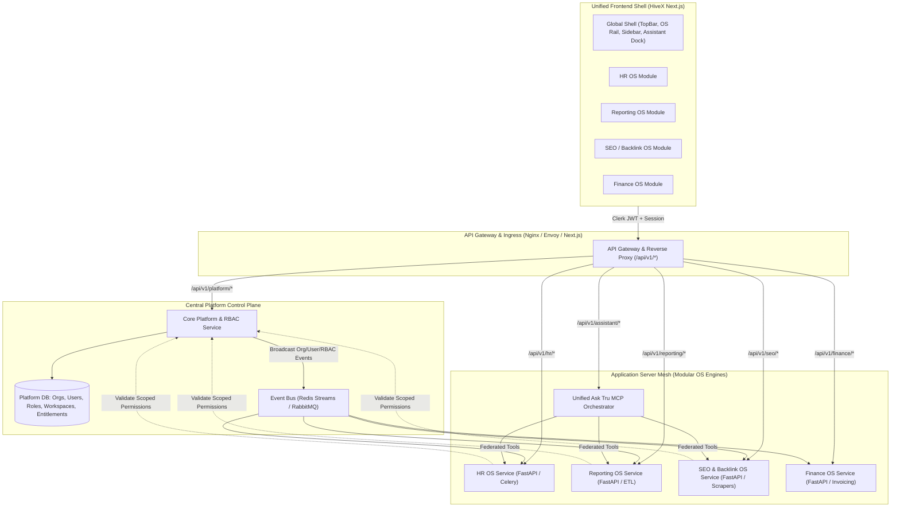
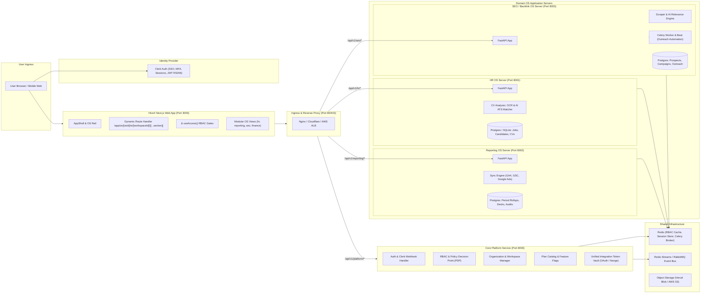
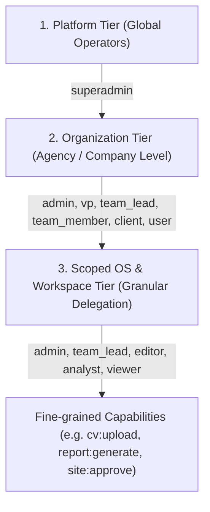
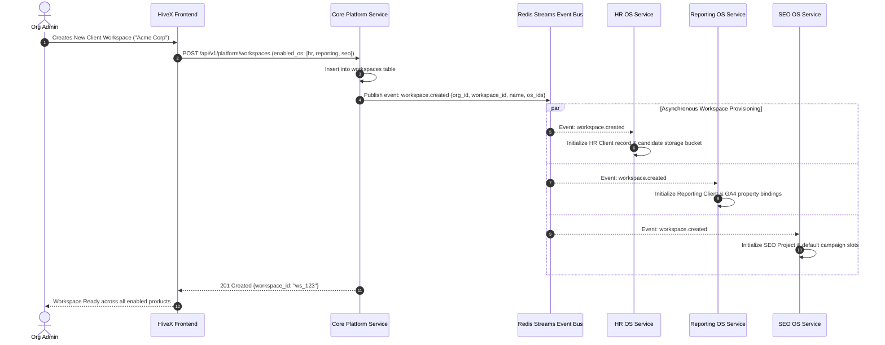
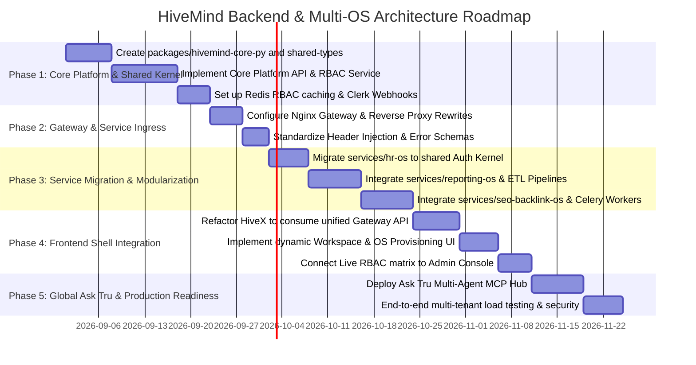

# HiveMind Platform — Unified Monorepo Architecture & Major Backend/Frontend Implementation Plan

---

## 1. Executive Summary & System Vision

**HiveMind** is an enterprise-grade, multi-tenant modular operating system ecosystem designed for agency and business operations. The platform unifies distinct operational domains (OS products) into a single, cohesive web application experience powered by a robust microservices backend architecture with centralized Identity, Role-Based Access Control (RBAC), Entitlements, and AI Orchestration.

### The Ecosystem


---

## 2. Core Architectural Principles & Problem Statement

### 2.1 The Challenge
1. **Multiple Independent Engines**: Each OS domain (e.g., HR OS, Reporting OS, SEO/Backlink OS) requires specialized runtime environments, heavy dependencies (OCR, ML models, Puppeteer/Playwright crawlers, GA4/Ads ETL syncs, Celery background workers), and isolated database schemas.
2. **Unified User Experience**: The end-user must experience HiveMind as a **single, seamless application**:
   - Single sign-on and unified navigation across all OS modules.
   - Shared concept of **Organizations** and **Workspaces** (Clients / Projects / Entities).
   - Unified Global Assistant (**Ask Tru**) that can query data across HR, Reporting, and SEO domains.
3. **Centralized RBAC & Entitlements**: Roles, memberships, feature flags, and permissions must be managed in **one central place**, while allowing each microservice to enforce fine-grained permissions without performance bottlenecks or code duplication.

### 2.2 Architectural Tenets
- **Modular Monorepo**: Keep frontend, core backend, microservices, and shared libraries in a unified monorepo with strict package boundaries.
- **Shared Kernel / SDK Pattern**: Distribute common authorization logic, schemas, JWT validation, and logging via shared Python and TypeScript libraries.
- **Federated Tenancy**: The Core Platform Service owns Organizations, Workspaces, and User Roles. Microservices store domain data referenced by `org_id` and `workspace_id`.
- **Stateless Verification with Cached Enriched Context**: Services verify Clerk RS256 JWTs locally and retrieve cached RBAC scopes via Redis or Enriched Gateway Headers.
- **Pluggable Frontend Architecture**: Adding a new OS requires registering its metadata and views in the frontend OS registry—without rewriting layout, navigation, or shell routing.

---

## 3. High-Level System Architecture



---

## 4. Multi-Tenant Role-Based Access Control (RBAC) Architecture

### 4.1 3-Tier Authorization Hierarchy

HiveMind implements a 3-tier hierarchical RBAC model designed for multi-client agencies:



#### Tier 1: Platform Tier (Cross-Org)
- **`superadmin`**: Platform owner/operator. Spans every organization, tenant, and OS instance.

#### Tier 2: Organization Tier
- **`admin`**: Full ownership of the tenant organization, billing/subscriptions, team members, integrations, and all OS products.
- **`vp`**: High-level manager. Can approve/remove members and access all workspaces; cannot modify billing.
- **`team_lead`**: Leads specific client workspaces, invites members, and connects integrations.
- **`team_member`**: Standard operational staff; restricted to assigned workspaces and OS products.
- **`client`**: External client guest; read-only viewer restricted strictly to their own client workspace.
- **`user`**: Newly registered user awaiting organization onboarding/approval.

#### Tier 3: Scoped OS & Workspace Tier
Inside each OS product and workspace, members hold a **Scoped Role**:
- **`admin`** (Rank 50): Full administrative power within the OS/Workspace.
- **`team_lead`** (Rank 40): Manage pipelines, assign tasks, trigger syncs.
- **`editor`** (Rank 30): Create and edit records (e.g., upload CVs, write campaigns, edit client notes).
- **`analyst`** (Rank 20): Read data, generate reports, view analytics, run AI queries.
- **`viewer`** (Rank 10): Read-only inspection of dashboards and summaries.

### 4.2 Centralized RBAC Data Model (Core Platform DB)

```sql
-- Organizations (Tenants)
CREATE TABLE organizations (
    id VARCHAR(64) PRIMARY KEY, -- Matches Clerk org_id or generated UUID
    name VARCHAR(255) NOT NULL,
    slug VARCHAR(100) UNIQUE NOT NULL,
    plan_tier VARCHAR(50) DEFAULT 'starter', -- starter, pro, enterprise
    created_at TIMESTAMPTZ DEFAULT NOW(),
    updated_at TIMESTAMPTZ DEFAULT NOW()
);

-- Organization Memberships & Global Org Role
CREATE TABLE org_memberships (
    id UUID PRIMARY KEY DEFAULT gen_random_uuid(),
    org_id VARCHAR(64) REFERENCES organizations(id) ON DELETE CASCADE,
    user_id VARCHAR(64) NOT NULL, -- Matches Clerk user_id
    email VARCHAR(255) NOT NULL,
    full_name VARCHAR(255),
    role VARCHAR(32) NOT NULL DEFAULT 'team_member', -- superadmin, admin, vp, team_lead, team_member, client, user
    status VARCHAR(32) NOT NULL DEFAULT 'pending', -- approved, pending, suspended
    created_at TIMESTAMPTZ DEFAULT NOW(),
    UNIQUE (org_id, user_id)
);

-- Product Subscriptions / OS Activation per Organization
CREATE TABLE org_os_subscriptions (
    id UUID PRIMARY KEY DEFAULT gen_random_uuid(),
    org_id VARCHAR(64) REFERENCES organizations(id) ON DELETE CASCADE,
    os_id VARCHAR(32) NOT NULL, -- reporting, hr, seo, finance
    status VARCHAR(32) NOT NULL DEFAULT 'discoverable', -- discoverable, checkout, setup, active, suspended
    plan_id VARCHAR(64),
    activated_at TIMESTAMPTZ,
    UNIQUE (org_id, os_id)
);

-- Unified Workspaces (Clients / Projects / Entities)
CREATE TABLE workspaces (
    id VARCHAR(64) PRIMARY KEY,
    org_id VARCHAR(64) REFERENCES organizations(id) ON DELETE CASCADE,
    name VARCHAR(255) NOT NULL,
    slug VARCHAR(100) NOT NULL,
    os_ids TEXT[] NOT NULL DEFAULT '{}', -- Which OS products are enabled for this workspace
    status VARCHAR(32) DEFAULT 'active',
    metadata JSONB DEFAULT '{}',
    created_at TIMESTAMPTZ DEFAULT NOW(),
    UNIQUE (org_id, slug)
);

-- Granular OS & Workspace Permissions per User
CREATE TABLE user_scoped_access (
    id UUID PRIMARY KEY DEFAULT gen_random_uuid(),
    org_id VARCHAR(64) REFERENCES organizations(id) ON DELETE CASCADE,
    user_id VARCHAR(64) NOT NULL,
    os_id VARCHAR(32) NOT NULL, -- reporting, hr, seo, finance
    workspace_id VARCHAR(64) REFERENCES workspaces(id) ON DELETE CASCADE, -- NULL means all workspaces in this OS
    scoped_role VARCHAR(32) NOT NULL DEFAULT 'editor', -- admin, team_lead, editor, analyst, viewer
    custom_permissions TEXT[] DEFAULT '{}',
    created_at TIMESTAMPTZ DEFAULT NOW(),
    UNIQUE (org_id, user_id, os_id, workspace_id)
);
```

### 4.3 Shared Python Auth Guard (`hivemind-core-py`)

All Python backend microservices (`hr-os`, `reporting-os`, `seo-os`, etc.) import the shared authorization kernel.

```python
# packages/hivemind-core-py/hivemind_core/auth/dependencies.py
import jwt
from fastapi import Header, HTTPException, Depends, Request
from pydantic import BaseModel
from typing import Optional, List
import redis.asyncio as redis

class AuthenticatedUser(BaseModel):
    user_id: str
    org_id: str
    org_role: str
    email: str
    scoped_roles: dict[str, str] = {} # {os_id: role}
    accessible_workspaces: dict[str, List[str]] = {} # {os_id: [workspace_ids]}

async def get_current_user(
    request: Request,
    authorization: Optional[str] = Header(None)
) -> AuthenticatedUser:
    """
    1. Validates Clerk RS256 JWT Token from header.
    2. Extracts sub (user_id) and org_id.
    3. Retrieves cached RBAC context from Redis (hydrated by Core Platform Service).
    4. Attaches AuthenticatedUser to request.state.
    """
    if not authorization or not authorization.startswith("Bearer "):
        raise HTTPException(status_code=401, detail="Unauthorized")
    
    token = authorization.removeprefix("Bearer ")
    # Decode and verify RS256 JWT via cached JWKS ...
    claims = verify_clerk_token(token)
    user_id = claims["sub"]
    org_id = claims.get("org_id") or claims.get("o", {}).get("id")

    # Fast Redis Lookup for full RBAC subject context
    rbac_context = await get_cached_user_rbac(org_id, user_id)
    return rbac_context

def require_permission(os_id: str, min_scoped_role: str = "viewer", require_workspace: bool = True):
    """
    Dependency factory to enforce OS and workspace permissions declaratively.
    """
    async def permission_guard(
        request: Request,
        user: AuthenticatedUser = Depends(get_current_user)
    ):
        # 1. Superadmin & Org Admins bypass scoped role check
        if user.org_role in ["superadmin", "admin", "vp"]:
            return user
        
        # 2. Check OS-level access
        user_os_role = user.scoped_roles.get(os_id)
        if not user_os_role:
            raise HTTPException(status_code=403, detail=f"Access to {os_id} denied")
        
        # 3. Check Workspace access if workspace_id in path/query
        workspace_id = request.path_params.get("workspace_id") or request.query_params.get("workspace_id")
        if require_workspace and workspace_id:
            allowed_workspaces = user.accessible_workspaces.get(os_id, [])
            if allowed_workspaces and workspace_id not in allowed_workspaces:
                raise HTTPException(status_code=403, detail=f"Access to workspace {workspace_id} denied")
        
        return user
    return permission_guard
```

---

## 5. Unified Monorepo Folder Structure

```
d:\Work\Hive_Mind 2.5/
├── .github/                         # CI/CD Workflows & Automations
│   └── workflows/
│       ├── test-frontend.yml
│       ├── test-services.yml
│       └── docker-build-push.yml
├── .gitignore                       # Master Monorepo .gitignore
├── README.md                        # Project documentation
├── docker-compose.yml               # Multi-container orchestration (local dev)
├── docker-compose.prod.yml          # Production multi-service compose
│
├── Docs/                            # Architecture & Product Specifications
│   ├── SYSTEM_ARCHITECTURE_HIVE_MIND_PLATFORM.md # (This File)
│   ├── HR_OS.md
│   ├── Backlink_Os.md
│   ├── SYSTEM_ARCHITECTURE Reporting Os.md
│   └── TECHNICAL HR_OS.md
│
├── packages/                        # Shared Cross-Cutting Packages
│   ├── shared-types/                # TypeScript interfaces & API schemas
│   │   ├── package.json
│   │   ├── src/
│   │   │   ├── auth.ts              # Org, User, RBAC & Role definitions
│   │   │   ├── workspace.ts         # Workspace & Tenant types
│   │   │   ├── os-registry.ts       # OS Product definitions
│   │   │   └── index.ts
│   │   └── tsconfig.json
│   │
│   ├── hivemind-core-py/            # Python Core Shared Library (FastAPI / Auth)
│   │   ├── pyproject.toml
│   │   └── hivemind_core/
│   │       ├── __init__.py
│   │       ├── auth/                # JWT verification, RBAC guards, Clerk sync
│   │       │   ├── dependencies.py
│   │       │   ├── models.py
│   │       │   └── jwt_verifier.py
│   │       ├── db/                  # Shared database mixins (tenant_id, timestamps)
│   │       ├── events/              # Redis Streams event publisher / subscriber
│   │       └── logging/             # Structured JSON logger & Tracing
│   │
│   └── config/                      # Shared ESLint, Prettier, Tailwind configurations
│
├── hivex/                           # Unified Next.js Frontend Web Application
│   ├── package.json
│   ├── next.config.mjs              # API Rewrites & Gateway routing
│   ├── tailwind.config.ts
│   ├── tsconfig.json
│   ├── public/                      # Static assets, logos, brand marks
│   └── src/
│       ├── app/                     # Next.js 15 App Router
│       │   ├── layout.tsx           # Global Root Layout (Providers, Theme, Clerk)
│       │   ├── page.tsx             # Public Marketing / Landing Page
│       │   ├── sign-in/             # Clerk Sign-in
│       │   ├── sign-up/             # Clerk Sign-up
│       │   └── app/                 # Authenticated Application Shell
│       │       ├── layout.tsx       # App Shell Layout (Rail, TopBar, Assistant Dock)
│       │       ├── page.tsx         # Platform Home / OS Launcher Dashboard
│       │       ├── admin/           # Organization Admin & RBAC Management
│       │       ├── assistant/       # Full-screen Ask Tru Assistant
│       │       ├── integrations/    # Platform-wide Integrations Directory
│       │       ├── settings/        # User & Org Settings
│       │       └── os/
│       │           └── [osId]/      # Dynamic OS Route Hub
│       │               ├── layout.tsx
│       │               ├── page.tsx # OS Marketing / Overview
│       │               ├── setup/   # OS Onboarding / Activation Funnel
│       │               ├── pricing/ # OS Plan Upgrade / Billing
│       │               └── w/
│       │                   └── [workspaceId]/ # Workspace Context Hub
│       │                       └── [[...section]]/
│       │                           └── page.tsx # Dynamic View Dispatcher
│       │
│       ├── components/              # Shared UI Design System Components
│       │   ├── shell/               # AppShell, TopBar, OSRail, ContextSidebar
│       │   ├── assistant/           # Ask Tru Floating Dock & Message Stream
│       │   ├── admin/               # Role Matrix, Member Invite, Audit Table
│       │   ├── integrations/        # Connect Dialog, Provider Cards
│       │   └── ui/                  # Buttons, Cards, Dialogs, Charts, Badges
│       │
│       ├── lib/                     # Client Infrastructure & Utilities
│       │   ├── access/              # RBAC Evaluation, Can.tsx, useAccess()
│       │   ├── state/               # React Context Providers (Identity, Assistant)
│       │   └── utils/               # Formatting, Storage, ClassNames
│       │
│       ├── os/                      # Modular OS UI Plugins (Micro-Frontends)
│       │   ├── registry.ts          # Master View Dispatcher
│       │   ├── types.ts             # WorkspaceView & OSModule definitions
│       │   ├── hr/                  # HR OS Module (Jobs, Candidates, Screening)
│       │   │   ├── api/             # HR API Client & Hooks
│       │   │   ├── components/      # CandidateDrawer, JobWizard, ApplicationsTable
│       │   │   └── views.tsx        # Registered section views
│       │   ├── reporting/           # Reporting OS Module (GA4, GSC, Decks, Audits)
│       │   │   ├── api/             # Reporting API Client
│       │   │   ├── components/      # RollupGrid, DeckGenerator, AnomalyCard
│       │   │   └── views.tsx
│       │   ├── seo/                 # SEO & Backlink OS Module (Prospects, Outreach)
│       │   │   ├── api/             # SEO API Client
│       │   │   ├── components/      # ProspectTable, EmailOutreachModal, Pipeline
│       │   │   └── views.tsx
│       │   └── finance/             # Finance OS Module (Invoices, Retainers)
│       │       └── views.tsx
│       │
│       └── platform/                # Platform Configuration & Catalogs
│           ├── config/              # os-registry.ts, plans.ts, roles.ts, brand.ts
│           └── types/               # OSProduct, OrgRole, Capability types
│
├── services/                        # Modular Backend Microservices
│   ├── core-platform/               # Service 0: Core Platform & Central RBAC Hub
│   │   ├── Dockerfile
│   │   ├── requirements.txt
│   │   ├── app/
│   │   │   ├── main.py              # FastAPI Application Entry
│   │   │   ├── core/                # Config, Redis Pool, Database Sessions
│   │   │   ├── models/              # Organizations, Workspaces, Memberships, Subscriptions
│   │   │   ├── routers/
│   │   │   │   ├── auth_webhook.py  # Clerk Webhook listener (User/Org Sync)
│   │   │   │   ├── rbac.py          # Role assignment & Permission introspection
│   │   │   │   ├── organizations.py # Org management & Settings
│   │   │   │   ├── workspaces.py    # Multi-tenant workspace CRUD
│   │   │   │   ├── subscriptions.py # Plan activation & Billing state
│   │   │   │   └── integrations.py  # Central OAuth / Nango Token Management
│   │   │   └── services/            # Cache invalidation, Event dispatching
│   │   └── migrations/              # Alembic SQL Migrations
│   │
│   ├── hr-os/                       # Service 1: HR OS & CV Analyzer Engine
│   │   ├── Dockerfile
│   │   ├── requirements.txt
│   │   ├── app/
│   │   │   ├── main.py              # FastAPI Router Entry
│   │   │   ├── core/                # Config & Shared Auth Guard
│   │   │   ├── db/                  # SQLAlchemy Base & Models (Jobs, Candidates)
│   │   │   ├── routers/             # /jobs, /applications, /dashboard, /clients
│   │   │   ├── schemas/             # Pydantic Schemas
│   │   │   └── services/            # OCR, ATS Screening, LLM Matching Pipeline
│   │   └── tests/
│   │
│   ├── reporting-os/                # Service 2: Marketing Reporting & ETL Engine
│   │   ├── Dockerfile
│   │   ├── requirements.txt
│   │   ├── app/
│   │   │   ├── main.py              # FastAPI App
│   │   │   ├── routers/             # /analytics, /search, /ads, /reports, /decks
│   │   │   ├── sync/                # GA4, GSC, Google Ads, GBP ETL Workers
│   │   │   ├── builders/            # Rollup Builder & Presentation Generator
│   │   │   └── mcp/                 # Model Context Protocol (MCP) Server
│   │   └── migrations/
│   │
│   ├── seo-backlink-os/             # Service 3: SEO Intelligence & Backlink Outreach
│   │   ├── Dockerfile
│   │   ├── requirements.txt
│   │   ├── app/
│   │   │   ├── main.py              # FastAPI App
│   │   │   ├── routers/             # /campaigns, /prospects, /outreach, /keywords
│   │   │   ├── pipeline/            # Scraper, Classifier, Relevance Scorer
│   │   │   ├── outreach/            # Resend Email Dispatcher & Follow-up Tracker
│   │   │   └── tasks/               # Celery Tasks & Celery Beat Scheduler
│   │   └── migrations/
│   │
│   └── ask-tru-orchestrator/        # Service 4: Global Multi-Agent AI Orchestrator
│       ├── Dockerfile
│       ├── requirements.txt
│       ├── app/
│       │   ├── main.py              # WebSocket & SSE Streaming Server
│       │   ├── agent/               # LangGraph / Model Context Protocol Agent
│       │   └── tools/               # Federated tool adapters calling HR, Reporting, SEO
│       └── prompts/
│
└── deploy/                          # Infrastructure as Code & Reverse Proxy
    ├── nginx/
    │   ├── default.conf             # Local development proxy pass configuration
    │   └── default.prod.conf        # Production SSL, Rate Limiting & Proxy Buffering
    ├── kubernetes/                  # Helm charts / K8s manifests (optional)
    └── scripts/                     # Seed scripts, DB migration runners
```

---

## 6. Inter-Service Communication & Event Mesh

### 6.1 Synchronous Communication (REST / gRPC / MCP)
- **Client to Gateway**: Frontend communicates exclusively via the API Gateway using standard HTTPS REST endpoints and WebSocket/SSE streams.
- **Gateway to Services**: The Gateway terminates SSL, forwards the request, and injects standardized trust headers:
  - `X-HiveMind-User-Id`: Clerk Subject ID
  - `X-HiveMind-Org-Id`: Tenant Organization ID
  - `X-HiveMind-Org-Role`: Global Org Role (`admin`, `team_lead`, etc.)
- **AI Tool Calling (Ask Tru)**: The AI Orchestrator queries individual OS services using the **Model Context Protocol (MCP)** or internal REST APIs with service-to-service mTLS or shared internal API keys.

### 6.2 Asynchronous Event Mesh (Redis Streams / RabbitMQ)



---

## 7. Frontend Modular Architecture & View Registration System

### 7.1 How a New OS is Added to the Frontend (Zero Core Shell Modification)

Adding a new product (e.g., `Finance OS`) requires only **3 self-contained steps**:

#### Step 1: Declare Product Metadata (`src/platform/config/os-registry.ts`)
```typescript
finance: {
  id: 'finance',
  name: 'Finance OS',
  shortName: 'Finance',
  icon: Coins,
  hue: '340 62% 56%',
  status: 'live',
  supportsWorkspaces: true,
  workspaceNoun: { singular: 'Entity', plural: 'Entities' },
  navigation: [
    { id: '', label: 'Overview', icon: LayoutDashboard, group: 'Overview' },
    { id: 'invoices', label: 'Invoices', icon: Receipt, group: 'Revenue' },
    { id: 'retainers', label: 'Retainers', icon: BadgeCheck, group: 'Revenue' },
  ]
}
```

#### Step 2: Create Views in Modular Directory (`src/os/finance/views.tsx`)
```typescript
// src/os/finance/views.tsx
import { WorkspaceView } from '@/os/types'
import { InvoicesView } from './components/InvoicesView'
import { RetainersView } from './components/RetainersView'

export const financeViews: Record<string, WorkspaceView> = {
  '': { title: 'Financial Overview', component: FinanceOverview },
  'invoices': { title: 'Client Invoices', component: InvoicesView },
  'retainers': { title: 'Retainer Burn', component: RetainersView },
}
```

#### Step 3: Register Views in Master Dispatcher (`src/os/registry.ts`)
```typescript
import { financeViews } from './finance/views'

export const OS_VIEWS: Record<OSId, OSViewMap> = {
  reporting: reportingViews,
  seo: seoViews,
  hr: hrViews,
  finance: financeViews, // <-- One single line
}
```

### 7.2 Declarative RBAC in React Components

Components never parse raw tokens or check strings inline. They use the centralized access layer:

```tsx
import { Can } from '@/lib/access/Can'
import { useAccess } from '@/lib/access/useAccess'

export function CandidateDrawer({ candidateId, workspaceId }: Props) {
  const { meetsRole, hasCap } = useAccess()
  const canShortlist = meetsRole('hr', 'editor')

  return (
    <div className="p-6">
      <CandidateDetails candidateId={candidateId} />

      {/* Button conditionally disabled or hidden based on role */}
      <Can osId="hr" minRole="editor" fallback={<p>Read only view</p>}>
        <button onClick={handleShortlist} className="btn-primary">
          Shortlist Candidate
        </button>
      </Can>

      {/* Capability check for admin-only actions */}
      <Can capability="members:invite">
        <InviteRecruiterButton />
      </Can>
    </div>
  )
}
```

---

## 8. Step-by-Step Implementation Roadmap



### Phase 1: Core Platform & Shared Kernel
- [ ] Create `packages/shared-types` with TypeScript definitions for Org, User, RBAC, Subscriptions, and Workspaces.
- [ ] Create `packages/hivemind-core-py` with Clerk JWT RS256 validator, FastAPI dependencies (`require_permission`), and Redis event bus client.
- [ ] Scaffold `services/core-platform` (FastAPI) managing DB tables: `organizations`, `org_memberships`, `workspaces`, `org_os_subscriptions`, `user_scoped_access`.
- [ ] Implement Clerk Webhook synchronization (`/webhooks/clerk`) for automated user and organization provisioning.

### Phase 2: API Gateway & Ingress Standardization
- [ ] Set up local `docker-compose.yml` with Nginx reverse proxy routing:
  - `/api/v1/platform/*` -> Core Platform (`:8000`)
  - `/api/v1/hr/*` -> HR OS (`:8001`)
  - `/api/v1/reporting/*` -> Reporting OS (`:8002`)
  - `/api/v1/seo/*` -> SEO OS (`:8003`)
  - `/` -> HiveX Frontend (`:3000`)
- [ ] Ensure CORS, Bearer token propagation, and standardized error responses (`401 Unauthorized`, `403 Forbidden`, `404 Not Found`).

### Phase 3: Service Migration & Modularization
- [ ] **HR OS (`services/hr-os`)**:
  - Replace standalone `clerk_auth.py` with `packages/hivemind-core-py`.
  - Link `clients` table to global `workspace_id`.
- [ ] **Reporting OS (`services/reporting-os`)**:
  - Integrate existing Reporting OS FastAPI backend into monorepo structure.
  - Bind GA4, GSC, and Google Ads credentials to global workspace tokens.
- [ ] **SEO / Backlink OS (`services/seo-backlink-os`)**:
  - Integrate scraper, relevance scorer, and Celery outreach worker into monorepo.
  - Link campaigns to global workspace entities.

### Phase 4: Frontend Shell Integration
- [ ] Update `hivex/src/lib/access/permissions.ts` to hydrate live user roles and subscriptions from Core Platform API (`/api/v1/platform/me/access`).
- [ ] Wire the Admin Console (`hivex/src/components/admin/`) to manage organization members, assign per-OS roles, and activate product subscriptions.
- [ ] Verify seamless switching between HR OS, Reporting OS, and SEO OS within the same browser session.

### Phase 5: Global Ask Tru Multi-Agent AI Hub
- [ ] Scaffold `services/ask-tru-orchestrator` with Model Context Protocol (MCP) clients connecting to HR, Reporting, and SEO backends.
- [ ] Connect the floating Assistant Dock in `hivex` to stream cross-domain insights in real time.

---

## 9. Security, Isolation & Production Deployment

1. **Tenant Data Isolation**:
   - Every database query in all services must include `WHERE org_id = :org_id` and `WHERE workspace_id = :workspace_id`.
   - PostgreSQL Row Level Security (RLS) policies configured for multi-tenant protection.
2. **Secret Management**:
   - Master API keys (OpenAI, Gemini, Resend, Nango, Clerk Secret Key) stored in environment vaults / secret managers, never committed to git.
   - Individual OAuth tokens for clients stored encrypted with AES-256 in the database.
3. **Local Development Simplicity**:
   - Single command `docker-compose up` spins up Redis, Postgres, Gateway, Core Platform, HR OS, Reporting OS, and HiveX Frontend with zero configuration conflict.

---

*Authored for the HiveMind Engineering Team. Architectural Reference Version 2.5.*
